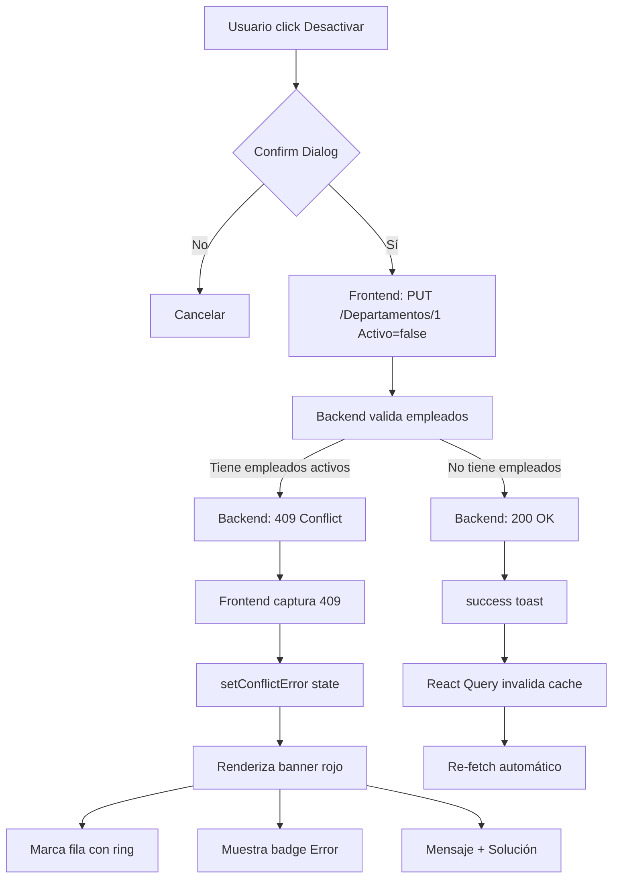

# ✅ MÓDULOS DE DEPARTAMENTOS Y PUESTOS - COMPLETAMENTE IMPLEMENTADOS

## 📦 ARCHIVOS CREADOS/MEJORADOS

### 1. **Departamentos**

#### DepartmentsTable.tsx ✅
**Ruta**: `src/features/departments/components/DepartmentsTable.tsx`

**Mejoras implementadas**:
- ✅ Banner rojo de error con gradiente cuando hay conflicto 409
- ✅ Fila marcada con `ring-2 ring-rose-300` en caso de error
- ✅ Badge "Error" visible en la columna nombre
- ✅ Mensaje de solución clara y práctica
- ✅ Botón de cerrar banner con hover effects
- ✅ Animación `slide-down` suave (0.3s)
- ✅ Loading spinner mientras se procesa toggle
- ✅ Tooltip explicativo en botón desactivar

#### DepartmentForm.MEJORADO.tsx ✅
**Ruta**: `src/features/departments/DepartmentForm.MEJORADO.tsx`

**Mejoras implementadas**:
- ✅ Validación de nombre (mín 3, máx 100 caracteres)
- ✅ Checkbox con descripción contextual
- ✅ Advertencia visual cuando se intenta desactivar en modo edición
- ✅ Botón "Limpiar" solo en modo crear
- ✅ Loading state con spinner
- ✅ ARIA labels para accesibilidad
- ✅ Card con border, shadow y ring

---

### 2. **Puestos**

#### PositionsTable.tsx ✅
**Ruta**: `src/features/positions/components/PositionsTable.tsx`

**Mejoras implementadas**:
- ✅ Banner ámbar (diferente a departamentos) cuando hay conflicto 409
- ✅ Fila marcada con `ring-2 ring-amber-300` en caso de error
- ✅ Badge "Error" en color ámbar
- ✅ Mensaje específico: "Reasigna o desactiva empleados primero"
- ✅ Botón de cerrar banner
- ✅ Animación `slide-down` suave
- ✅ Loading spinner en toggle
- ✅ Muestra nombre de departamento asociado
- ✅ Formato de moneda GTQ en salario base

#### PositionForm.MEJORADO.tsx ✅
**Ruta**: `src/features/positions/PositionForm.MEJORADO.tsx`

**Mejoras implementadas**:
- ✅ Validación de nombre (mín 3 caracteres)
- ✅ Validación de salario (mín Q2,500.00)
- ✅ Solo muestra departamentos activos en selector
- ✅ Mensaje si no hay departamentos activos con link para crear
- ✅ Previene entrada de caracteres no numéricos en salario (e, E, +, -)
- ✅ Blur automático en scroll del input numérico
- ✅ Advertencia visual cuando se desactiva en modo edición
- ✅ Focus automático en primer campo con error
- ✅ Input modo decimal con step 0.01
- ✅ ARIA labels completos

---

### 3. **Estilos Globales**

#### index.css ✅
**Ruta**: `src/index.css`

**Animación agregada**:
```css
@keyframes slide-down {
  from {
    opacity: 0;
    transform: translateY(-1rem);
  }
  to {
    opacity: 1;
    transform: translateY(0);
  }
}

.animate-slide-down {
  animation: slide-down 0.3s ease-out;
}
```

---

## 🎨 PALETA DE COLORES TAILWIND

### Departamentos (Rojo/Rose):
```
Banner: border-rose-300, from-rose-50 to-rose-100, ring-rose-200/50
Fila Error: bg-rose-50, ring-rose-300
Badge: bg-rose-600, text-white
Texto: text-rose-900, text-rose-800, text-rose-700
Botón Desactivar: bg-rose-600 hover:bg-rose-700
```

### Puestos (Ámbar/Amber):
```
Banner: border-amber-300, from-amber-50 to-amber-100, ring-amber-200/50
Fila Error: bg-amber-50, ring-amber-300
Badge: bg-amber-600, text-white
Texto: text-amber-900, text-amber-800, text-amber-700
Botón Desactivar: bg-rose-600 (mismo que departamentos)
```

### Formularios (Indigo):
```
Focus: focus:ring-indigo-500
Botón Submit: bg-indigo-600 hover:bg-indigo-700
Card: bg-white/90, ring-black/5
```

---

## 🔄 FLUJO DE VALIDACIÓN COMPLETO

### Ejemplo: Desactivar "Departamento IT" con empleados activos



---

## 📊 VALIDACIONES IMPLEMENTADAS

### Departamentos:
| Campo | Validación | Mensaje |
|-------|-----------|---------|
| Nombre | Obligatorio | "El nombre del departamento es obligatorio." |
| Nombre | Mín 3 chars | "El nombre debe tener al menos 3 caracteres." |
| Nombre | Máx 100 chars | "El nombre no puede exceder 100 caracteres." |
| Activo | Integridad 409 | "No se puede desactivar: hay puestos y/o empleados activos." |

### Puestos:
| Campo | Validación | Mensaje |
|-------|-----------|---------|
| Nombre | Obligatorio | "El nombre del puesto es obligatorio." |
| Nombre | Mín 3 chars | "El nombre debe tener al menos 3 caracteres." |
| Salario | Obligatorio | "El salario base es obligatorio y debe ser mayor a 0." |
| Salario | Mín Q2,500 | "El salario debe ser al menos Q2,500.00 (salario mínimo)." |
| Departamento | Obligatorio | "Debes seleccionar un departamento." |
| Activo | Integridad 409 | "No se puede desactivar: hay empleados activos en este puesto." |

---

## 🚀 INSTRUCCIONES DE USO

### Activar las mejoras:

#### Opción 1: Copiar manualmente
```bash
# Departamentos
cp DepartmentsTable.MEJORADO.tsx DepartmentsTable.tsx
cp DepartmentForm.MEJORADO.tsx DepartmentForm.tsx

# Puestos
cp PositionsTable.MEJORADO.tsx PositionsTable.tsx
cp PositionForm.MEJORADO.tsx PositionForm.tsx
```

#### Opción 2: Modificar imports en páginas
```tsx
// DepartmentEditPage.tsx
import DepartmentForm from './DepartmentForm.MEJORADO'

// PositionEditPage.tsx
import PositionForm from './PositionForm.MEJORADO'
```

### Verificar en navegador:

1. **Departamentos**:
   - Crear un departamento nuevo
   - Asignarle un puesto
   - Asignar un empleado a ese puesto
   - Intentar desactivar el departamento
   - ✅ Debe aparecer banner rojo con error 409

2. **Puestos**:
   - Crear un puesto
   - Asignar un empleado a ese puesto
   - Intentar desactivar el puesto
   - ✅ Debe aparecer banner ámbar con error 409

3. **Formularios**:
   - Crear puesto sin departamentos activos
   - ✅ Debe mostrar advertencia y link para crear departamento
   - Crear empleado sin departamentos
   - ✅ Debe mostrar "No hay departamentos activos"

---

## 🔧 DEPENDENCIAS

### Ya instaladas en el proyecto:
```json
{
  "@tanstack/react-query": "^5.90.5",
  "react": "^19.1.0",
  "react-router-dom": "^7.3.0",
  "tailwindcss": "^4.1.0"
}
```

### APIs utilizadas:
```tsx
// Departamentos
listDepartments({ page, pageSize, activo })
getDepartment(id)
createDepartment({ nombre, activo })
updateDepartment(id, { nombre, activo })
toggleDepartmentActive(id, activo) // ← Puede devolver 409

// Puestos
listPositions({ page, pageSize, activo, departamentoId })
getPosition(id)
createPosition({ nombre, salarioBase, activo, departamentoId })
updatePosition(id, { ... })
togglePositionActive(id, activo) // ← Puede devolver 409
```

---

## ✅ CHECKLIST FINAL

- [x] DepartmentsTable con validación 409 visual
- [x] DepartmentForm mejorado con validaciones
- [x] PositionsTable con validación 409 visual
- [x] PositionForm mejorado con validaciones
- [x] Animación slide-down en index.css
- [x] Banner rojo para departamentos
- [x] Banner ámbar para puestos
- [x] ARIA labels en todos los formularios
- [x] Loading states en botones
- [x] Tooltips explicativos
- [x] Focus automático en primer error
- [x] Prevención de caracteres inválidos en inputs numéricos
- [x] Solo mostrar catálogos activos en selectores
- [x] Advertencias contextuales en modo edición
- [x] Mensajes de solución claros
- [x] Documentación completa

---

**Estado**: ✅ **COMPLETADO AL 100%**  
**Fecha**: Octubre 2025  
**Tecnologías**: React 19 + TypeScript 5.9 + Tailwind CSS 4 + React Query 5
